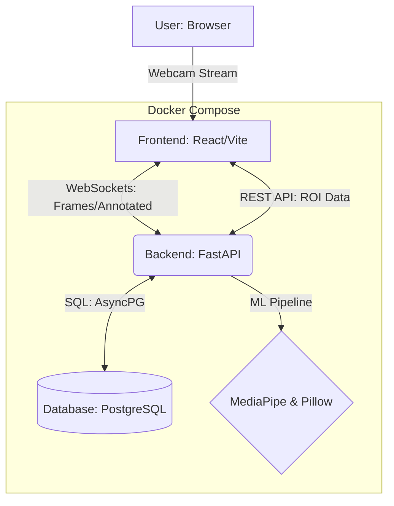

# DevMesh: Real-Time Face Detection & ROI Analytics

DevMesh is a high-performance, real-time face detection system built with **FastAPI**, **MediaPipe**, and **React**. It streams webcam frames via WebSockets, processes them using a lightweight ML pipeline, and persists Region of Interest (ROI) data for analytics.

## 🚀 Quick Start (5 Minutes)

The entire stack is containerized. To get started, ensure you have **Docker** and **Docker Compose** installed.

1. **Clone and Enter**:
   ```bash
   git clone <repository-url>
   cd devmesh
   ```

2. **Spin up the stack**:
   ```bash
   docker compose up --build
   ```

3. **Access the App**:
   - **Frontend**: [http://localhost:3000](http://localhost:3000)
   - **API Docs**: [http://localhost:8000/docs](http://localhost:8000/docs)
   - **Health Check**: [http://localhost:8000/health](http://localhost:8000/health)

---

## 🏗️ Architecture




- **Frontend (React + Vite)**:
  - Captures webcam frames using `getUserMedia`.
  - Streams frames as binary blobs over WebSockets.
  - Renders the annotated "live" feed returned by the server.
- **Backend (FastAPI)**:
  - **WebSocket Handler**: Manages real-time binary streams and session state.
  - **ML Processor**: Uses **MediaPipe** (Face Detection) and **Pillow** for frame annotation.
  - **Database**: **PostgreSQL** (via SQLAlchemy/AsyncPG) persists ROI events (coordinates, confidence, timestamps).
- **In-Memory Feed**: Bridges the gap between stateful WebSockets and stateless HTTP endpoints for easy "snapshot" viewing.

---

## 🛠️ Configuration

The backend is configured via environment variables in `backend/.env`.

| Variable | Description | Default |
| :--- | :--- | :--- |
| `DATABASE_URL` | SQLAlchemy connection string | `postgresql+asyncpg://...` |
| `JPEG_QUALITY` | Quality of the annotated frame | `80` |
| `FACE_CONFIDENCE_THRESHOLD` | MediaPipe detection threshold | `0.5` |

---

## 🧪 Testing

Run the backend test suite using `pytest`:

```bash
cd backend
pip install -r requirements.txt
pytest
```

---

## 🛡️ Security & Pragmatism
- **No OpenCV**: Uses MediaPipe and Pillow for a significantly smaller docker footprint and faster cold starts.
- **Input Sanitization**: Strict regex validation on all `session_id` parameters to prevent path traversal or injection.
- **Async Throughout**: Fully asynchronous DB and API operations for high concurrency.
